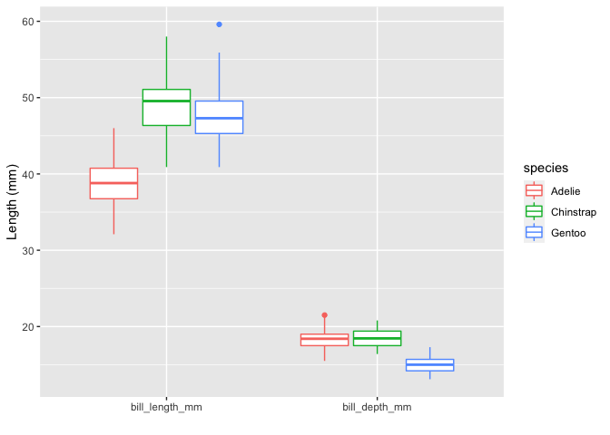

Programming in R
================

  - [Getting Started](#getting-started)
  - [The Basics](#the-basics)
      - [Data Structures](#data-structures)
      - [Scalars](#scalars)
      - [Vectors](#vectors)
      - [Factors](#factors)
      - [Matrices and Arrays](#matrices-and-arrays)
      - [Lists](#lists)
      - [Data Frames](#data-frames)
      - [Conditional Statements](#conditional-statements)
      - [Loops](#loops)
  - [Advanced](#advanced)
      - [Tidyverse](#tidyverse)
      - [`janitor`](#janitor)
      - [`magrittr`](#magrittr)
      - [`dplyr`](#dplyr)
      - [`purrr`](#purrr)
      - [`glue`](#glue)
      - [`reshape2`](#reshape2)
      - [`ggplot2`](#ggplot2)

<!-- README.md is generated from README.Rmd. Please edit that file -->

## Getting Started

R is a free programming language for statistical computing and graphics.
It is an implementation of the S programming language and was created by
Ross Ihaka and Robert Gentleman at the University of Auckland, New
Zealand. R is currently developed by the R Development Core Team.
RStudio is an Integrated Development Environment (IDE) for R.

## The Basics

We can use R as a calculator to do simple math operations such as
addition `+`, subtraction `-`, multiplication `*`, division `\`, and
raise a value to a power `^`. We can type these calculations in the
console or run them in an R script that extension ends in `.R`

``` r
# We can use hashtags to make comments about our code
```

``` r
4 + 5
```

    [1] 9

``` r
4 - 5
```

    [1] -1

``` r
4 * 5
```

    [1] 20

``` r
4 / 5
```

    [1] 0.8

``` r
4 ^ 5
```

    [1] 1024

### Data Structures

R has many data structures and types that we can use, depending on the
information we want to work with. The major data types include:

  - character
  - numeric (real or decimal)
  - integer
  - logical
  - double
  - complex

The major data structures include:

  - Scalars
  - Atomic Vectors
  - Factors
  - Lists
  - Matrices and Arrays
  - Dataframes

### Scalars

The simplest type of object is a scalar which is an object with one
value. We can assign a value or calculations to a variable using the
assignment operator `<-`.

Note: The equals sign `=` is not an assignment operator in R and has a
different functionality which will be discussed further below.

To create scalar data objects x and y:

``` r
x <- 4    
y <- 5
```

The objects x and y were set a numeric data type.

We can manipulate these objects in R and perform different calculations
together. To print the value of these variables, we can use the print()
function or call the variable itself.

``` r
z <- x+y   
z
```

    [1] 9

``` r
print(z)
```

    [1] 9

``` r
x*y/z
```

    [1] 2.222222

As stated above, we can also create data objects of other data types
such as logical and character mode.

For logical data, we use TRUE (T) and FALSE (F)

``` r
Logical <- T
Logical
```

    [1] TRUE

For character data, we use single or double quotation to enclose the
data

``` r
Character_Data <- "T"
Character_Data
```

    [1] "T"

We can use available functions in R to determine the mode or type of
data we are working with.

``` r
mode(x)
```

    [1] "numeric"

``` r
mode(Logical)
```

    [1] "logical"

``` r
mode(Character_Data)
```

    [1] "character"

``` r
is(x)
```

    [1] "numeric" "vector" 

``` r
is(Logical)
```

    [1] "logical" "vector" 

``` r
is(Character_Data)
```

``` 
[1] "character"           "vector"              "data.frameRowLabels"
[4] "SuperClassMethod"   
```

### Vectors

A vector is a basic data structure in R. It is a set of scalars of the
same data type.

We can create vectors in different ways.

One of the main ways is to use the function c() to concatenate multiple
scalars together.

``` r
x <- c(1, 5, 4, 9, 0)
x
```

    [1] 1 5 4 9 0

We can use function typeof() to determine the data type of a vector, and
we can check the length of the vector using the funtion length() .

``` r
x <- c(1, 5, FALSE, 9, "help")
x 
```

    [1] "1"     "5"     "FALSE" "9"     "help" 

``` r
typeof(x)
```

    [1] "character"

Instead of reassigning the elements of x using the function c(), we
could reassign specific elements based on the index number.

``` r
x
```

    [1] "1"     "5"     "FALSE" "9"     "help" 

``` r
x[3] <- 4
x[5] <- 0
x
```

    [1] "1" "5" "4" "9" "0"

``` r
typeof(x)
```

    [1] "character"

Other ways to creat vectors is to use other operators and functions such
as “:” operator, seq() function, and rep() function.

``` r
# Create vector of consecutive numbers
y <- 1:10
y
```

``` 
 [1]  1  2  3  4  5  6  7  8  9 10
```

``` r
# Create vector of a sequence of numbers
# Defining number of points in an interval or step size
seq(1, 10, by = 1)
```

``` 
 [1]  1  2  3  4  5  6  7  8  9 10
```

``` r
seq(1, 10, length.out = 10)
```

``` 
 [1]  1  2  3  4  5  6  7  8  9 10
```

``` r
# A set of 5 numbers with value set as 3
rep(3, 5)
```

    [1] 3 3 3 3 3

### Factors

A factor is a special type of character vector. Factors are qualitative
or categorical variables that are often used in statistical modeling. To
create a factor data structure, we will first create a character vector
and convert it to a factor using the factor() function.

``` r
temperature <- c("High","Medium","Low")
temperature <- factor(temperature)
```

Converting temperature character vector to a factor type creates
“levels” based on the factor values (these are the values of
categorical variables).

``` r
temperature
```

    [1] High   Medium Low   
    Levels: High Low Medium

### Matrices and Arrays

So far we have discussed one-dimensional objects. We can create objects
of multidimensional data. Matrices are data structures that contain data
values in two dimensions. An array is a matrix with more than two
dimensions. Matrices and arrays are used perform efficient calculations
in a computationally fast and efficient manner.

To create a matrix, we can use the matrix() function, which takes as
arguments a data vector and parameters for the number of rows and
columns.

We can determine the dimensions of a matrix using the dim() function.

``` r
mat <- matrix(c(2,6,3,8),nrow=2,ncol=2)
mat
```

``` 
     [,1] [,2]
[1,]    2    3
[2,]    6    8
```

``` r
dim(mat)
```

    [1] 2 2

We can also choose to add row names and column names to the matrix.

``` r
rownames(mat) <- c("a", "b")
colnames(mat) <- c("c", "d")
```

``` r
mat<-matrix(c(2,6,3,8), nrow=2, ncol=2, dimnames=list(c("a","b"), c("c","d")))
```

``` r
# Index-based subsetting
mat[1:2,1:2]
```

``` 
  c d
a 2 3
b 6 8
```

``` r
# Column/row-based subsetting
mat["a",1:2]
```

    c d 
    2 3 

We can also create a matrix by concatenating vectors together using
rbind() function to concatenate by rows or cbind() function to
concatenate by columns.

``` r
x <- 1:3
y <- 4:6
# Combine by rows
a <- rbind(x,y)
a
```

``` 
  [,1] [,2] [,3]
x    1    2    3
y    4    5    6
```

``` r
# Combined by columns
b <- cbind(x,y)
b
```

``` 
     x y
[1,] 1 4
[2,] 2 5
[3,] 3 6
```

To create an array, we can use the function array(), which takes as
arguments vectors as input and uses the values in the dim parameter to
create an array.

``` r
vector1 <- c(1,2,3)
vector2 <- c(5,6,7,8,9,10)

# Create an array with dimension (3,3,2) that creates 2 arrays each with 3 rows and 3 columns. 
array1 <- array(c(vector1,vector2),dim = c(3,3,2))
array1
```

    , , 1
    
         [,1] [,2] [,3]
    [1,]    1    5    8
    [2,]    2    6    9
    [3,]    3    7   10
    
    , , 2
    
         [,1] [,2] [,3]
    [1,]    1    5    8
    [2,]    2    6    9
    [3,]    3    7   10

### Lists

Lists are data objects which contain elements of different types
including numbers, strings, vectors, and other lists. A list can also
contain a matrix or even a function as its elements.

``` r
#Create a list of different data types

list_data <- list(c(2,4,6,8), "Hello", matrix(c(11,12,13,14), nrow=2,ncol=2), TRUE, 62.13, FALSE)
print(list_data)
```

    [[1]]
    [1] 2 4 6 8
    
    [[2]]
    [1] "Hello"
    
    [[3]]
         [,1] [,2]
    [1,]   11   13
    [2,]   12   14
    
    [[4]]
    [1] TRUE
    
    [[5]]
    [1] 62.13
    
    [[6]]
    [1] FALSE

``` r
# Give names to the elements in the list
names(list_data) <- c("Vector1", "Character1", "Matrix1", "Logical1", "Numeric", "Logical2")
list_data
```

    $Vector1
    [1] 2 4 6 8
    
    $Character1
    [1] "Hello"
    
    $Matrix1
         [,1] [,2]
    [1,]   11   13
    [2,]   12   14
    
    $Logical1
    [1] TRUE
    
    $Numeric
    [1] 62.13
    
    $Logical2
    [1] FALSE

We can use the function str() to list the underlying structure of the
data object.

``` r
str(list_data)
```

    List of 6
     $ Vector1   : num [1:4] 2 4 6 8
     $ Character1: chr "Hello"
     $ Matrix1   : num [1:2, 1:2] 11 12 13 14
     $ Logical1  : logi TRUE
     $ Numeric   : num 62.1
     $ Logical2  : logi FALSE

### Data Frames

A data frame is a table in which each column contains values of one
variable or vector and each row contains one set of values from each
column. Within each column, all data elements must be of the same data
type. However, different columns can be of different data types. The
data stored in a data frame can be of numeric, factor or character type.
In addition, each column should contain same number of data elements.

To create a data frame, we can use the function data.frame():

``` r
#Create a data frame with employee ID, salaries, and start dates

emp.data <- data.frame( 
emp_id = c("U974","U503","U298","U545","U612"),
salary = c(623.3,515.2,611.0,729.0,843.25), 
start_date = as.Date(c("2012-01-01", "2013-09-23", "2014-11-15", "2014-05-11",
  "2015-03-27")),
stringsAsFactors = FALSE
)

emp.data
```

``` 
  emp_id salary start_date
1   U974 623.30 2012-01-01
2   U503 515.20 2013-09-23
3   U298 611.00 2014-11-15
4   U545 729.00 2014-05-11
5   U612 843.25 2015-03-27
```

We can use the function str() to list the underlying structure of the
data object.

``` r
str(emp.data)
```

    'data.frame':   5 obs. of  3 variables:
     $ emp_id    : chr  "U974" "U503" "U298" "U545" ...
     $ salary    : num  623 515 611 729 843
     $ start_date: Date, format: "2012-01-01" "2013-09-23" ...

We can extract data from the data frame and also add data to the data
frame.

``` r
#Extract salary information
emp.data$salary
```

    [1] 623.30 515.20 611.00 729.00 843.25

``` r
#Add column vector
emp.data$dept <- c("IT","Operations","IT","HR","Finance")
```

### Conditional Statements

Logical and relational operators can be used to execute code based on
certain conditions. Common operators include:

``` r
q <- 3
t <- 5

#if else conditional statement 
if (q<t) {
    w<-q+t
} else {
    w<-q-t
}

w
```

    [1] 8

``` r
a<-2
b<-3
c<-4

# Using and to test two conditions, both true
if (a<b & b<c) x<-a+b+c

x
```

    [1] 9

### Loops

We can use looping to efficiently repeat code without having to write
the same code over and over.

The while loop repeats a condition while the expression in parenthesis
holds true and takes the form:

``` r
x<-0
while (x<=5){
    x <- x+1
}
x
```

    [1] 6

For loops are used to iterate through a process a specified number of
times. A counter variable such as “i” is used to count the number of
times the loop is executed:

``` r
#Create empty vector
y <- vector(mode="numeric")

#Loop through 1 to 10 to add values to y
for (i in 1:10) {
  y[i]<-i
}

y
```

``` 
 [1]  1  2  3  4  5  6  7  8  9 10
```

## Advanced

### Tidyverse

One of the best advantages of R is it’s unique ability to work with
data.
[Tidyverse](https://www.rstudio.com/wp-content/uploads/2015/02/data-wrangling-cheatsheet.pdf)
is a collection of packages for wrangling and visualizing data for
statistical analysis. These are the packages you will likely use on a
day to day basis in bioinformatics.

``` r
library(magrittr)
library(dplyr)
library(tidyr)
library(purrr)
library(janitor)
library(glue)
library(reshape2)
library(ggplot2)
```

Or just call them all…

``` r
library(tidyverse)
```

### `janitor`

Look at how ugly these column names are…

``` r
head(df)
```

    # A tibble: 6 × 8
      Species ISLAND    `Bill_Length$(M… bill.depth.mm flipper.length.… `body.mass.(g)`
      <fct>   <fct>                <dbl>         <dbl>            <int>           <int>
    1 Adelie  Torgersen             39.1          18.7              181            3750
    2 Adelie  Torgersen             39.5          17.4              186            3800
    3 Adelie  Torgersen             40.3          18                195            3250
    4 Adelie  Torgersen             NA            NA                 NA              NA
    5 Adelie  Torgersen             36.7          19.3              193            3450
    6 Adelie  Torgersen             39.3          20.6              190            3650
    # … with 2 more variables: SEX <fct>, YEAR <int>

Clean them with `janitor`

``` r
df <- janitor::clean_names(df)
colnames(df)
```

``` 
[1] "species"           "island"            "bill_length_mm"   
[4] "bill_depth_mm"     "flipper_length_mm" "body_mass_g"      
[7] "sex"               "year"             
```

``` r
head(df)
```

    # A tibble: 6 × 8
      species island bill_length_mm bill_depth_mm flipper_length_… body_mass_g sex  
      <fct>   <fct>           <dbl>         <dbl>            <int>       <int> <fct>
    1 Adelie  Torge…           39.1          18.7              181        3750 male 
    2 Adelie  Torge…           39.5          17.4              186        3800 fema…
    3 Adelie  Torge…           40.3          18                195        3250 fema…
    4 Adelie  Torge…           NA            NA                 NA          NA <NA> 
    5 Adelie  Torge…           36.7          19.3              193        3450 fema…
    6 Adelie  Torge…           39.3          20.6              190        3650 male 
    # … with 1 more variable: year <int>

Get a summary of the data

``` r
summary(penguins)
```

``` 
      species          island    bill_length_mm  bill_depth_mm  
 Adelie   :152   Biscoe   :168   Min.   :32.10   Min.   :13.10  
 Chinstrap: 68   Dream    :124   1st Qu.:39.23   1st Qu.:15.60  
 Gentoo   :124   Torgersen: 52   Median :44.45   Median :17.30  
                                 Mean   :43.92   Mean   :17.15  
                                 3rd Qu.:48.50   3rd Qu.:18.70  
                                 Max.   :59.60   Max.   :21.50  
                                 NA's   :2       NA's   :2      
 flipper_length_mm  body_mass_g       sex           year     
 Min.   :172.0     Min.   :2700   female:165   Min.   :2007  
 1st Qu.:190.0     1st Qu.:3550   male  :168   1st Qu.:2007  
 Median :197.0     Median :4050   NA's  : 11   Median :2008  
 Mean   :200.9     Mean   :4202                Mean   :2008  
 3rd Qu.:213.0     3rd Qu.:4750                3rd Qu.:2009  
 Max.   :231.0     Max.   :6300                Max.   :2009  
 NA's   :2         NA's   :2                                 
```

### `magrittr`

**`%>%`**

Here we want to find the average bill length in inches.

``` r
# Fine
mean_bill_length_in <- mean(df$bill_length_mm * 0.0393701, na.rm=TRUE)
print(mean_bill_length_in)
```

    [1] 1.729211

``` r
# Better
mean_bill_length_in <- df %>%
  dplyr::pull(bill_length_mm) %>%
  magrittr::multiply_by(0.0393701) %>%
  mean(na.rm=TRUE)
print(mean_bill_length_in)
```

    [1] 1.729211

**`set_colnames()`**

``` r
df %>%
magrittr::set_colnames(paste0("Column_", seq(ncol(.)))) %>%
head()
```

    # A tibble: 6 × 8
      Column_1 Column_2  Column_3 Column_4 Column_5 Column_6 Column_7 Column_8
      <fct>    <fct>        <dbl>    <dbl>    <int>    <int> <fct>       <int>
    1 Adelie   Torgersen     39.1     18.7      181     3750 male         2007
    2 Adelie   Torgersen     39.5     17.4      186     3800 female       2007
    3 Adelie   Torgersen     40.3     18        195     3250 female       2007
    4 Adelie   Torgersen     NA       NA         NA       NA <NA>         2007
    5 Adelie   Torgersen     36.7     19.3      193     3450 female       2007
    6 Adelie   Torgersen     39.3     20.6      190     3650 male         2007

You can also insert short hand functions\!

``` r
df %>%
dplyr::pull(bill_length_mm) %>%
(function(x) {
  return(x * 0.0393701)
}) %>%
mean(na.rm=TRUE)
```

    [1] 1.729211

### `dplyr`

Please check out the [full
reference](https://dplyr.tidyverse.org/reference/index.html) for more
functions

**`mutate()`**

Modify a new or existing column

``` r
df %>%
dplyr::mutate(bill_length_in = bill_length_mm * 0.0393701) %>%
head()
```

    # A tibble: 6 × 9
      species island bill_length_mm bill_depth_mm flipper_length_… body_mass_g sex  
      <fct>   <fct>           <dbl>         <dbl>            <int>       <int> <fct>
    1 Adelie  Torge…           39.1          18.7              181        3750 male 
    2 Adelie  Torge…           39.5          17.4              186        3800 fema…
    3 Adelie  Torge…           40.3          18                195        3250 fema…
    4 Adelie  Torge…           NA            NA                 NA          NA <NA> 
    5 Adelie  Torge…           36.7          19.3              193        3450 fema…
    6 Adelie  Torge…           39.3          20.6              190        3650 male 
    # … with 2 more variables: year <int>, bill_length_in <dbl>

**`filter()`**

Filter rows

``` r
df %>%
dplyr::filter(species == "Chinstrap") %>%
head()
```

    # A tibble: 6 × 8
      species island bill_length_mm bill_depth_mm flipper_length_… body_mass_g sex  
      <fct>   <fct>           <dbl>         <dbl>            <int>       <int> <fct>
    1 Chinst… Dream            46.5          17.9              192        3500 fema…
    2 Chinst… Dream            50            19.5              196        3900 male 
    3 Chinst… Dream            51.3          19.2              193        3650 male 
    4 Chinst… Dream            45.4          18.7              188        3525 fema…
    5 Chinst… Dream            52.7          19.8              197        3725 male 
    6 Chinst… Dream            45.2          17.8              198        3950 fema…
    # … with 1 more variable: year <int>

**`select()`**

Select columns

``` r
df %>%
dplyr::select(species, body_mass_g) %>%
head()
```

    # A tibble: 6 × 2
      species body_mass_g
      <fct>         <int>
    1 Adelie         3750
    2 Adelie         3800
    3 Adelie         3250
    4 Adelie           NA
    5 Adelie         3450
    6 Adelie         3650

**`pull()`**

Select columns and flatten to vector

``` r
df %>%
dplyr::pull(body_mass_g) %>%
head()
```

    [1] 3750 3800 3250   NA 3450 3650

**`arrange()`**

Order rows

``` r
df %>%
dplyr::arrange(desc(body_mass_g)) %>%
head()
```

    # A tibble: 6 × 8
      species island bill_length_mm bill_depth_mm flipper_length_… body_mass_g sex  
      <fct>   <fct>           <dbl>         <dbl>            <int>       <int> <fct>
    1 Gentoo  Biscoe           49.2          15.2              221        6300 male 
    2 Gentoo  Biscoe           59.6          17                230        6050 male 
    3 Gentoo  Biscoe           51.1          16.3              220        6000 male 
    4 Gentoo  Biscoe           48.8          16.2              222        6000 male 
    5 Gentoo  Biscoe           45.2          16.4              223        5950 male 
    6 Gentoo  Biscoe           49.8          15.9              229        5950 male 
    # … with 1 more variable: year <int>

**`across()`**

Apply function across columns

``` r
df %>%
dplyr::mutate(dplyr::across(c(bill_length_mm, bill_depth_mm), round)) %>%
head()
```

    # A tibble: 6 × 8
      species island bill_length_mm bill_depth_mm flipper_length_… body_mass_g sex  
      <fct>   <fct>           <dbl>         <dbl>            <int>       <int> <fct>
    1 Adelie  Torge…             39            19              181        3750 male 
    2 Adelie  Torge…             40            17              186        3800 fema…
    3 Adelie  Torge…             40            18              195        3250 fema…
    4 Adelie  Torge…             NA            NA               NA          NA <NA> 
    5 Adelie  Torge…             37            19              193        3450 fema…
    6 Adelie  Torge…             39            21              190        3650 male 
    # … with 1 more variable: year <int>

**`group_by()` + `summarise()`** Group by columns and compute summary
statistics

``` r
df %>%
dplyr::group_by(species) %>%
dplyr::summarise(n=n(), mass=mean(body_mass_g, na.rm=TRUE))
```

    # A tibble: 3 × 3
      species       n  mass
      <fct>     <int> <dbl>
    1 Adelie      152 3701.
    2 Chinstrap    68 3733.
    3 Gentoo      124 5076.

**Conditional mutate**

``` r
df %>%
dplyr::mutate(body_size=
      dplyr::case_when(body_mass_g > 5000 ~ "Massive",
                       body_mass_g > 4000 ~ "Big",
                       TRUE ~ "Small")) %>%
dplyr::pull(body_size) %>%
table()
```

    .
        Big Massive   Small 
        111      61     172 

### `purrr`

**Mutate with two or more columns**

``` r
df.xyz <- data.frame(x=c(1,3), y=c(1,3), z=c(1,3))
head(df.xyz)
```

``` 
  x y z
1 1 1 1
2 3 3 3
```

``` r
df.xyz <- df.xyz %>%
      dplyr::mutate(xyz = purrr::pmap(list(x, y, z), function(a, b, c) {
          a + b + c
      }))
head(df.xyz)
```

``` 
  x y z xyz
1 1 1 1   3
2 3 3 3   9
```

### `glue`

String manipulation and formatting

``` r
name <- "Fred"
glue('My name is {name}.')
```

    My name is Fred.

``` r
df %>%
dplyr::select(species, bill_length_mm, sex) %>%
tidyr::drop_na() %>%
dplyr::mutate(desc = glue("This {sex} penguin ({species}) has a bill length of {bill_length_mm} mm")) %>%
head()
```

    # A tibble: 6 × 4
      species bill_length_mm sex    desc                                            
      <fct>            <dbl> <fct>  <glue>                                          
    1 Adelie            39.1 male   This male penguin (Adelie) has a bill length of…
    2 Adelie            39.5 female This female penguin (Adelie) has a bill length …
    3 Adelie            40.3 female This female penguin (Adelie) has a bill length …
    4 Adelie            36.7 female This female penguin (Adelie) has a bill length …
    5 Adelie            39.3 male   This male penguin (Adelie) has a bill length of…
    6 Adelie            38.9 female This female penguin (Adelie) has a bill length …

### `reshape2`

**`melt()`**

Melt a data frame for visualization

``` r
df %>%
dplyr::select(species, bill_length_mm, bill_depth_mm) %>%
reshape2::melt(id=c("species")) %>%
head(5)
```

``` 
  species       variable value
1  Adelie bill_length_mm  39.1
2  Adelie bill_length_mm  39.5
3  Adelie bill_length_mm  40.3
4  Adelie bill_length_mm    NA
5  Adelie bill_length_mm  36.7
```

### `ggplot2`

Melted data frames are good for plotting

``` r
df %>%
dplyr::select(species, bill_length_mm, bill_depth_mm) %>%
reshape2::melt(id=c("species")) %>%
ggplot(aes(x=variable, y=value, color=species)) +
labs(x="", y="Length (mm)") +
geom_boxplot()
```

<!-- -->
