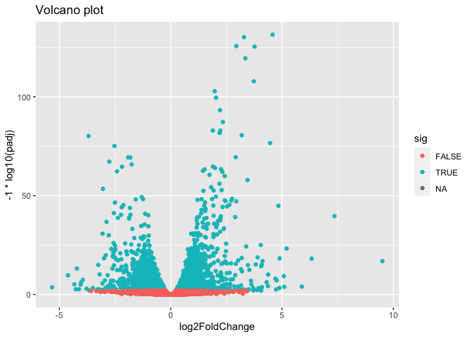
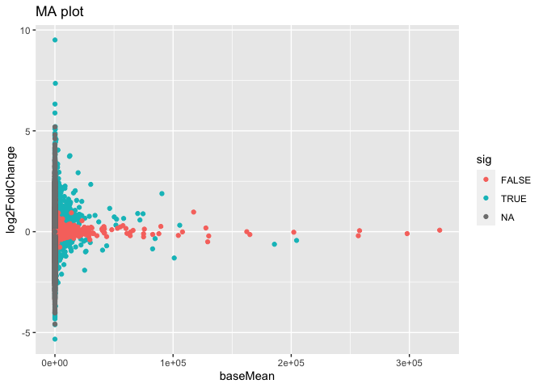

R Workshop: RNA-seq Airway Data and Differential Expression Analysis
================

  - [Install and load packages](#install-and-load-packages)
  - [Working with `data.frame` objects](#working-with-dataframe-objects)
      - [Asking R for help](#asking-r-for-help)
  - [Working with `matrix` objects](#working-with-matrix-objects)
      - [Plot the distibutions before and after
        log-transformation](#plot-the-distibutions-before-and-after-log-transformation)
  - [Dimensionality Reduction](#dimensionality-reduction)
      - [Feature selection](#feature-selection)
      - [PCA](#pca)
  - [Running simple comparative statistical
    analyses](#running-simple-comparative-statistical-analyses)
      - [Running one test](#running-one-test)
      - [Wrapper functions](#wrapper-functions)
      - [Apply loops](#apply-loops)
      - [Matrix operations](#matrix-operations)
  - [Loading data from an R package](#loading-data-from-an-r-package)
  - [Install packages from
    Bioconductor](#install-packages-from-bioconductor)
  - [Gene Set Enrichment Analysis](#gene-set-enrichment-analysis)
      - [Downloading genesets](#downloading-genesets)
      - [A signature of differentially expressed
        genes](#a-signature-of-differentially-expressed-genes)
      - [Fast GSEA](#fast-gsea)
      - [Gene Symbols](#gene-symbols)

<!-- README.md is generated from README.Rmd. Please edit that file -->

In this workshop, we will focus on learning how to load packages, import
data, perform exploratory analysis with built in functions as well as
functions from packages installed, performing differential expression
analysis of RNA-seq data with the DESeq2 package, and visualizing the
results using ggplot2.

# Install and load packages

We will begin by loading the necessary packages:

  - `readr`
  - `magrittr`
  - `dplyr`
  - `ggplot2`

<!-- end list -->

``` r
packages <- c("readr", "ggplot2", "dplyr", "magrittr")
install.packages(packages, dependencies = TRUE)
```

Load these libraries using library(“package\_name”) function:

If you have not downloaded the R\_Workshop folder already, please do
that now.

Let’s begin first by setting our working directory. Set your working
directory to where the R\_Workshop folder is located on your computer.

``` r
#Find working directory
getwd()

#Set working directory path
setwd("(path to R workshop directory on your computer)")

#Check working directory again
getwd()
```

Today we will work with the airway dataset. This data set comes from an
RNA-Seq experiment, a high throughput sequencing method, on four human
airway smooth muscle cell lines treated and untreated with
dexamethasone. We will work with read counts or expression matrix for
this dataset (i.e. processed files).

Note: The sequencing files of this experiment are available on the GEO
database with GEO Series Number GSE52778, and can be downloaded using
SRA toolkit.

Use the read.csv(“file”) function import the airway\_scalecounts.csv
(count data) and airway\_metadata.csv (meta data) files from the
downloaded folder R\_Workshop.

``` r
# Use  read.csv() function to import 
# - data/airway_scaledcounts.csv
# - data/airway_metadata.csv files into R
```

Use base functions to describe and look at the airway data: scaledcounts
and metadata.

dim() - Dimensions head() - Print first lines of data tail() - Print
last few lines of data str() - Describe data object structure and
information

``` r
# Use base functions to gain an initial view of the data
```

``` 
          id     dex celltype     geo_id
1 SRR1039508 control   N61311 GSM1275862
2 SRR1039509 treated   N61311 GSM1275863
3 SRR1039512 control  N052611 GSM1275866
4 SRR1039513 treated  N052611 GSM1275867
5 SRR1039516 control  N080611 GSM1275870
6 SRR1039517 treated  N080611 GSM1275871
```

``` 
          ensgene SRR1039508 SRR1039509 SRR1039512 SRR1039513 SRR1039516 SRR1039517 SRR1039520 SRR1039521
1 ENSG00000000003        723        486        904        445       1170       1097        806        604
2 ENSG00000000005          0          0          0          0          0          0          0          0
3 ENSG00000000419        467        523        616        371        582        781        417        509
4 ENSG00000000457        347        258        364        237        318        447        330        324
5 ENSG00000000460         96         81         73         66        118         94        102         74
6 ENSG00000000938          0          0          1          0          2          0          0          0
```

# Working with `data.frame` objects

Looking at `scaledcounts` we can see that the first column, “ensgene”,
gives the gene identifier for each gene, while each successive column
gives the expression values for each gene.

``` r
# Use the `ensgene` column to extract the gene expression values for "ENSG00000002549".
```

``` 
           ensgene SRR1039508 SRR1039509 SRR1039512 SRR1039513 SRR1039516 SRR1039517 SRR1039520 SRR1039521
23 ENSG00000002549       1460       1274       1280        980       1428       1770        829       1003
```

This is okay, but a little clunky. Alternatively we can set the gene
identifiers as row names to index rows directly.

``` r
# 1  Set the gene identifiers to row names in `scaledcounts`.
# 2  Remove the `ensgene` column.
# 3  Extract the gene expression values using the string "ENSG00000002549" directly.
```

``` 
                SRR1039508 SRR1039509 SRR1039512 SRR1039513 SRR1039516 SRR1039517 SRR1039520 SRR1039521
ENSG00000002549       1460       1274       1280        980       1428       1770        829       1003
```

### Asking R for help

Alternative to steps 1 + 2 above, we could have set gene identifiers to
row names when we read in the file.

``` r
# 1 Look up the help page for `read.csv()` using `?read.csv`, scroll down to the `row.names` in the "Arguments" section.  

# 2 Use these instructions to reread in `scaledcounts` and set the gene identifiers to row names automatically.
```

``` 
                SRR1039508 SRR1039509 SRR1039512 SRR1039513 SRR1039516 SRR1039517 SRR1039520 SRR1039521
ENSG00000000003        723        486        904        445       1170       1097        806        604
ENSG00000000005          0          0          0          0          0          0          0          0
ENSG00000000419        467        523        616        371        582        781        417        509
ENSG00000000457        347        258        364        237        318        447        330        324
ENSG00000000460         96         81         73         66        118         94        102         74
ENSG00000000938          0          0          1          0          2          0          0          0
```

# Working with `matrix` objects

The main difference between a `data.frame` object and a `matrix` object
is that each column of a `data.frame` is free to have it’s own format,
whereas all values within an entire `matrix` must have the same format.
One nice thing about `matrix` objects is that functions in R can be
applied to all values at once. Note, that after setting the gene
identifiers to row names, each value in `scaledcounts` is now a number.

For gene expression it is common to work with log-scaled count data
because these tend to adhere more closely to normal distributions than
unscaled count data. The one caveat to this that log(0) = -Inf. To
overcome this, it is common practice to add a small value prior to
performing log-transformations, most commonly by adding one to every
value, log(1) = 0. This is referred to as a **pseudocount**.

``` r
# 1 Use the `as.matrix()` function to convert `scaledcounts` to a matrix.

# 2 Add a pseudocount to every value.

# 3 Use the `log2()` function to log-scale the matrix.
```

``` r
head(scaledcounts_log2)
```

``` 
                SRR1039508 SRR1039509 SRR1039512 SRR1039513 SRR1039516 SRR1039517 SRR1039520 SRR1039521
ENSG00000000003   9.499846   8.927778   9.821774   8.800900  10.193525  10.100662   9.656425   9.240791
ENSG00000000005   0.000000   0.000000   0.000000   0.000000   0.000000   0.000000   0.000000   0.000000
ENSG00000000419   8.870365   9.033423   9.269127   8.539159   9.187352   9.611025   8.707359   8.994353
ENSG00000000457   8.442943   8.016808   8.511753   7.894818   8.317413   8.807355   8.370687   8.344296
ENSG00000000460   6.599913   6.357552   6.209453   6.066089   6.894818   6.569856   6.686501   6.228819
ENSG00000000938   0.000000   0.000000   1.000000   0.000000   1.584963   0.000000   0.000000   0.000000
```

## Plot the distibutions before and after log-transformation

``` r
# your code here
```

<!-- -->

# Dimensionality Reduction

## Feature selection

First find the 1000 most varying genes

``` r
# your code here
```

``` r
head(varying_genes)
```

    ENSG00000237724 ENSG00000227739 ENSG00000204389 ENSG00000129824 ENSG00000275746 ENSG00000215328 
           33.21438        29.36837        28.41751        26.64051        25.33514        24.12912 

``` r
length(varying_genes)
```

    [1] 1000

Subset the log-transformed counts with them.

``` r
# your code here
```

``` r
dim(scaledcounts_log2_var)
```

    [1] 1000    8

``` r
head(scaledcounts_log2_var)
```

``` 
                SRR1039508 SRR1039509 SRR1039512 SRR1039513 SRR1039516 SRR1039517 SRR1039520 SRR1039521
ENSG00000237724   0.000000   0.000000    0.00000   0.000000  10.706496   10.99577   10.61563   10.80252
ENSG00000227739   0.000000   0.000000    0.00000   0.000000   5.087463    0.00000   12.47548   11.33260
ENSG00000204389   9.726218   9.878051   10.53625   9.705632   0.000000    0.00000    0.00000    0.00000
ENSG00000129824  12.270003  12.061709   12.16522  11.275543  12.287424   12.33623    0.00000    2.00000
ENSG00000275746  10.435670  10.968667    0.00000   0.000000  10.345405   11.41521   10.35755   11.46404
ENSG00000215328  10.624795  10.598053    0.00000   0.000000   0.000000    0.00000    0.00000    0.00000
```

## PCA

Here is some example code for reducing the dimensionality of the data
using Principal Component Analysis (PCA). We can use PCA to visualize
the similarity between the samples and their metadata.

``` r
pca <- prcomp(t(scaledcounts_log2_var), scale=TRUE)
pca.summary <- summary(pca)
pca.summary$importance[,1:5]
```

``` 
                            PC1      PC2      PC3      PC4      PC5
Standard deviation     16.61046 13.68972 13.27857 13.18278 8.338794
Proportion of Variance  0.27591  0.18741  0.17632  0.17379 0.069540
Cumulative Proportion   0.27591  0.46332  0.63964  0.81342 0.882960
```

``` r
pca.df <- cbind(data.frame(PC1=pca$x[,"PC1"], PC2=pca$x[,"PC2"]), metadata)
head(pca.df)
```

``` 
                  PC1         PC2         id     dex celltype     geo_id
SRR1039508 -12.647648  22.2096355 SRR1039508 control   N61311 GSM1275862
SRR1039509 -15.037194  11.5174950 SRR1039509 treated   N61311 GSM1275863
SRR1039512  -3.964374  -0.4337529 SRR1039512 control  N052611 GSM1275866
SRR1039513 -10.760689 -14.2287749 SRR1039513 treated  N052611 GSM1275867
SRR1039516  24.767877   8.0484739 SRR1039516 control  N080611 GSM1275870
SRR1039517  27.430093  -1.0223949 SRR1039517 treated  N080611 GSM1275871
```

Using `pca.df` plot the first and second principle components and color
the data points by cell type.

``` r
# your code here
```

<!-- -->

# Running simple comparative statistical analyses

Later in this workshop, we will use a robust Bioconductor package to run
differential gene expression analysis. The basis for this type of
analysis is common when analyzing high-throughput data. It has the
following steps…

1.  Extract the expression values for a single gene.
2.  Run compare the mean expression between two groups using a
    statistical test.
3.  Repeat steps 1 + 2 for every gene.

### Running one test

The t-test is a common choice for performing a differential analysis.
Next we will perform a simple differential test comparing treated and
control groups in our gene expression data. The “dex” column in
`metadata` gives group values for treated and control samples.

``` r
# 1 Create a new data.frame called `genedata` with two columns: 1) log-transformed expression values of "ENSG00000002549" and 2) group values from the "dex" variable. Call the columns "ex" and "group", respectively. 

# 2 Run the following to use the `t.test()` function to compare the log transformed expression values between treated and control samples with pooled variance (var.equal = TRUE).
ttestRes <- t.test(ex ~ group, data = genedata, var.equal = TRUE)
```

Note that the syntax at the begining of this function, you will see it a
lot. Look up ?formula for more information. This is common in functions
for statistical modelling, as well as base R plotting functions. For
example, instead of running a t-test we could run a linear model.

``` r
lmRes <- lm(ex ~ group, data = genedata)
print(summary(lmRes))
```

Note, that the p-value for the linear model is equal to the p-value for
the t-test. This is because simple linear regression models are
equivalent to a t-test with pooled variance.

We can use a similar syntax to create boxplots of the expression values
for either group with the `boxplot()` function.

``` r
boxplot(ex ~ group, data = genedata)
```

As we can see, the difference in mean is very small relative to the
variance, hence the large p-value.

### Wrapper functions

What if we want to run a t-test on any gene? We can greatly reduce the
amount of code we need to write by writing a function that takes a gene
identifier as an argument, runs the t-test, and returns information we
are interested in. For example, below is a function that takes the
arguments, `geneid` and returns a vector with two values: the difference
in mean and p-value.

``` r
# Function to run t-test for a given gene ID
ttestGene <- function(geneid) {
    
    # Create data matrix
    genedata <- data.frame(ex = scaledcounts[geneid,], group = metadata$dex)
    
    # Run t-test
    ttestRes <- t.test(ex ~ group, data = genedata)
    
    # Get difference in mean
    diffMean <- ttestRes$estimate[2] - ttestRes$estimate[1]
    
    # Get difference and p-value
    results <- c(diffMean, pvalue = ttestRes$p.value)
    
    # Given these values a name
    names(results) <- c("diff", "pvalue")
    
    return(results)
}

# Run it on "ENSG00000002549"
ttestGene("ENSG00000002549")
```

### Apply loops

We can run this analysis using an apply loop. In are there are several
choices of apply loops, for this case we will use the `sapply()`
function. `sapply()` takes two arguments: a vector and a function. You
may want to check the help page, `?apply`, for other options. `sapply()`
takes every value of a vector and **applies** it to the first argument
of the function argument.

``` r
# 1 Run sapply for the first 1000 genes in `scaledcounts` using their names and the `ttestGene()` function.  Write the ouput to an object called `res`.
# 2 Transpose the output with t().
```

### Matrix operations

Loops are great and often necessary, but whenever possible utilizing
matrix operations is a great way to speed up runtime. The maximum
likelihood estimates of linear regression coefficients can be estimated
using the following formula, \[\hat{\beta} = (X^TX)^{-1}X^Ty.\] Here, X
is and \(N\times P\) matrix of variables, and \(y\) can be a vector of
outcome variables, in this case gene expression values for specific
gene. \(X^T\) denotes that a given matrix is transposed and $()^{-1}
denotes taking the inverse of the items in the parenthesis.

``` r
X <- model.matrix(~ group, data = genedata)
print(X)
```

The three basic matrix operations functions in R are: 1. `t()`:
Transpose matrix input. 2. `solve()`: Take the inverse of matrix input.
3. `%*%`: Multiply matrices on the left and right.

``` r
# 1 Use the formula for the maximum likelihood estimates of linear regression coefficients above to generate the difference in mean of log transformed expression values between treated and control samples for "ENSG00000002549". 
```

In actuality, \(y\) need not be a vector, but instead a \(N \times Q\)
matrix, where \(Q\) is a set of variables for which you’d like to
indepedently test the relationships to \(X\).

``` r
# 1 Use the formula for the maximum likelihood estimates of linear regression coefficients above to estimate the difference in log transformed expression values between treated and control samples for the first 1000 genes in `scaledcounts`.
```

# Loading data from an R package

# Install packages from Bioconductor

``` r
install.packages("BiocManager")
BiocManager::install("SummarizedExperiment")
BiocManager::install("DESeq2")
BiocManager::install("airway")
```

``` r
library(SummarizedExperiment)
library(DESeq2)
library(airway)
```

This data set is also available in a package called “airway” in
bioconductor. It is saved as an S4 object (object oriented programming)
that contains the count data, meta data, and other information important
to the data in fields or slots in the object. To load the airway data we
can use the data(“data\_name”) function and call airway to add the
dataset to our workspace.

You’ll notice that the class is called RangedSummarizedExperiment
(i.e. an S4 object), which is used to store matrices of experimental
results such as the count data and meta data. This class is from the
SummarizedExperiment package which is used often to store sequencing and
microarray data.

``` r
# Call airway data using data() and print airway data to save to workspace
```

    class: RangedSummarizedExperiment 
    dim: 6 8 
    metadata(1): ''
    assays(1): counts
    rownames(6): ENSG00000000003 ENSG00000000005 ... ENSG00000000460 ENSG00000000938
    rowData names(0):
    colnames(8): SRR1039508 SRR1039509 ... SRR1039520 SRR1039521
    colData names(9): SampleName cell ... Sample BioSample

Since we imported the same data set twice, we can remove data from our
workspace using the rm() function.

Let’s remove the variables scaledcounts and metadata from our workspace.
We’ll keep the airway object since it will be easier to work with for
downstream analysis.

``` r
# Remove scaledcounts and metadata variable
```

Let’s first do some preliminary work with the airway dataset. The
sample/metadata information is saved under the slot colData which can be
extracted using <airway@colData> or colData(airway).

First check the data structure of the colData(airway) dataset.

Hint: Built in functions to check data structure

Let’s set colData(airway) as a data frame.

Hint: We will use the as.data.frame() function to do this.

``` r
# Check mode of colData(airway) and make change the structure to a data frame.
```

    DataFrame with 8 rows and 9 columns
               SampleName     cell      dex    albut        Run avgLength Experiment    Sample    BioSample
                 <factor> <factor> <factor> <factor>   <factor> <integer>   <factor>  <factor>     <factor>
    SRR1039508 GSM1275862  N61311     untrt    untrt SRR1039508       126  SRX384345 SRS508568 SAMN02422669
    SRR1039509 GSM1275863  N61311     trt      untrt SRR1039509       126  SRX384346 SRS508567 SAMN02422675
    SRR1039512 GSM1275866  N052611    untrt    untrt SRR1039512       126  SRX384349 SRS508571 SAMN02422678
    SRR1039513 GSM1275867  N052611    trt      untrt SRR1039513        87  SRX384350 SRS508572 SAMN02422670
    SRR1039516 GSM1275870  N080611    untrt    untrt SRR1039516       120  SRX384353 SRS508575 SAMN02422682
    SRR1039517 GSM1275871  N080611    trt      untrt SRR1039517       126  SRX384354 SRS508576 SAMN02422673
    SRR1039520 GSM1275874  N061011    untrt    untrt SRR1039520       101  SRX384357 SRS508579 SAMN02422683
    SRR1039521 GSM1275875  N061011    trt      untrt SRR1039521        98  SRX384358 SRS508580 SAMN02422677

The count data is saved under the slot assay. We can extract the count
matrix by calling <airway@assay> or assay(airway). We can also use
descriptive statistics to look at the expression acrosss samples. We
will sum the expression of each column and scale by 1e6 to get scaled
expression value. We will then use the summary() function to look at the
range of expression between the samples.

Determine a way to sum the expression of each column.

Hint: You can use a for loop, apply function, or base functions such as
colSums()

``` r
# 1 Sum the expression of each column, divide by 1e6
```

``` r
print(col_cpm)
```

    SRR1039508 SRR1039509 SRR1039512 SRR1039513 SRR1039516 SRR1039517 SRR1039520 SRR1039521 
      20.63797   18.80948   25.34865   15.16342   24.44841   30.81821   19.12615   21.16413 

``` r
# 2 Use summary function to see the range of values between each sample
```

``` 
   SRR1039508       SRR1039509         SRR1039512         SRR1039513         SRR1039516         SRR1039517      
 Min.   :     0   Min.   :     0.0   Min.   :     0.0   Min.   :     0.0   Min.   :     0.0   Min.   :     0.0  
 1st Qu.:     0   1st Qu.:     0.0   1st Qu.:     0.0   1st Qu.:     0.0   1st Qu.:     0.0   1st Qu.:     0.0  
 Median :     0   Median :     0.0   Median :     0.0   Median :     0.0   Median :     0.0   Median :     0.0  
 Mean   :   322   Mean   :   293.4   Mean   :   395.4   Mean   :   236.6   Mean   :   381.4   Mean   :   480.8  
 3rd Qu.:    10   3rd Qu.:     8.0   3rd Qu.:    12.0   3rd Qu.:     6.0   3rd Qu.:    11.0   3rd Qu.:    12.0  
 Max.   :297906   Max.   :255662.0   Max.   :513766.0   Max.   :273878.0   Max.   :397791.0   Max.   :401539.0  
   SRR1039520         SRR1039521      
 Min.   :     0.0   Min.   :     0.0  
 1st Qu.:     0.0   1st Qu.:     0.0  
 Median :     0.0   Median :     0.0  
 Mean   :   298.4   Mean   :   330.2  
 3rd Qu.:     9.0   3rd Qu.:     8.0  
 Max.   :378834.0   Max.   :372489.0  
```

We will use DESeq2 package for differential expression analysis of the
airway data set to find differentially expressed genes between untreated
and treated samples. We will first load DESeq2 and set up the data to be
compatible with DESeq by using the function DESeqDataSet().

We can use the help(“function\_name”) or ?function\_name to look up the
function to get a description.

A description or help pages will show up under the Help tab in the
bottom right corner.

``` r
# Look up DESeqDataSet() function description 
```

We can also go to the bioconductor page for DESeq2 and look at the
manual for functions as well as a tutorial of using the package itself.
Click here to see the
[page](https://bioconductor.org/packages/release/bioc/html/DESeq2.html)

The function DESeqDataSet includes an argument called design which asks
for a formula that expresses how the counts for each gene depends on the
variables in colData. In this case we choose variables cell and dex
because we care about the cell line and which samples are treated with
dexamethasone versus which samples are untreated controls.

``` r
DE_airway <- DESeqDataSet(airway, design = ~ cell + dex)

DE_airway
```

    class: DESeqDataSet 
    dim: 64102 8 
    metadata(2): '' version
    assays(1): counts
    rownames(64102): ENSG00000000003 ENSG00000000005 ... LRG_98 LRG_99
    rowData names(0):
    colnames(8): SRR1039508 SRR1039509 ... SRR1039520 SRR1039521
    colData names(9): SampleName cell ... Sample BioSample

Before we continue, we must set our control group as our reference level
for comparison in our differential expression analysis.

``` r
DE_airway@colData$dex <- relevel(DE_airway@colData$dex, ref = "untrt")
```

Now we will run the differential expression analysis steps through the
function DESeq(). Again we can look up the function to learn more about
what it does and the arguments needed to run it. We use the results()
function to generate a results table with log2 fold changes, p values
and adjusted p values for each gene. The log2 fold change and the Wald
test p value is based on the last variable in the design formula, in
this case variable dex. Therefore our results will show which genes are
deferentially expressed between the untreated and treated groups.

``` r
DE_airway <- DESeq(DE_airway)
res <- results(DE_airway)

# Make sure we keep these as a column for later
res$ensembl <- rownames(res)
```

How do we order the results table (res) based on the p-value? There are
already available functions in R that we can use to sort the dataframe.
Hint: Use function order() to order the rows based on p-value

``` r
# Use order() to order the results table based on the p-value
```

``` r
head(res)
```

    log2 fold change (MLE): dex trt vs untrt 
    Wald test p-value: dex trt vs untrt 
    DataFrame with 6 rows and 7 columns
                     baseMean log2FoldChange     lfcSE      stat       pvalue         padj         ensembl
                    <numeric>      <numeric> <numeric> <numeric>    <numeric>    <numeric>     <character>
    ENSG00000152583   997.440        4.57492  0.184056   24.8561 2.22232e-136 4.00640e-132 ENSG00000152583
    ENSG00000165995   495.093        3.29106  0.133174   24.7125 7.83976e-135 7.06676e-131 ENSG00000165995
    ENSG00000120129  3409.029        2.94781  0.121438   24.2743 3.66732e-130 2.20381e-126 ENSG00000120129
    ENSG00000101347 12703.387        3.76700  0.155438   24.2347 9.58234e-130 4.31876e-126 ENSG00000101347
    ENSG00000189221  2341.767        3.35358  0.141782   23.6530 1.09937e-123 3.96389e-120 ENSG00000189221
    ENSG00000211445 12285.615        3.73040  0.165831   22.4953 4.61814e-112 1.38760e-108 ENSG00000211445

In DESeq2, the function plotMA generates an MA Plot commonly used to
visualize the differential expression results. The plot shows the log2
fold changes attributable to a given variable over the mean of
normalized counts for all the samples in the DESeqDataSet. Points
represent genes and will be colored red if the adjusted p value is less
than 0.1. Points which fall out of the window are plotted as open
triangles pointing either up or down.

``` r
plotMA(res, ylim=c(-2,2))
```

<!-- -->

Let’s add a column that tell us whether each gene is significant. Using
the mutate() function from library dplyr, we can add a column showing
whether the significance is TRUE or FALSE based on cutoff padj \< 0.01.

``` r
# Change res to a tibble format to work with dplyr
res <- tbl_df(res)

# Add sig column to show which genes are significant or not by using mutate() from dplyr
res <- mutate(res, sig=padj<0.01)

# We can use the symbol %>% from library magrittr to represent a pipe. Pipes take the output from one function and feed it to the first argument of the next function. You may have seen something similar in unix with |
res <- res %>% mutate(sig=padj<0.01)

head(res)
```

    # A tibble: 6 × 8
      baseMean log2FoldChange lfcSE  stat    pvalue      padj ensembl         sig  
         <dbl>          <dbl> <dbl> <dbl>     <dbl>     <dbl> <chr>           <lgl>
    1     997.           4.57 0.184  24.9 2.22e-136 4.01e-132 ENSG00000152583 TRUE 
    2     495.           3.29 0.133  24.7 7.84e-135 7.07e-131 ENSG00000165995 TRUE 
    3    3409.           2.95 0.121  24.3 3.67e-130 2.20e-126 ENSG00000120129 TRUE 
    4   12703.           3.77 0.155  24.2 9.58e-130 4.32e-126 ENSG00000101347 TRUE 
    5    2342.           3.35 0.142  23.7 1.10e-123 3.96e-120 ENSG00000189221 TRUE 
    6   12286.           3.73 0.166  22.5 4.62e-112 1.39e-108 ENSG00000211445 TRUE 

Let’s use the filter() function from dplyr to filter out results based
on padj \< 0.01, and write this to a csv file using write\_csv()
function from readr.

Try using piping format %\>% to do this\!

``` r
# Filter res based on cutoff padj < 0.01 and save this result into a csv file called significant_results.csv
```

``` r
res %>%
dplyr::filter(padj < 0.01) %>%
write_csv("significant_results.csv")
```

What if we want to generate our own plots? We can use ggplot2 to create
our own volcano plot of the differential expression results between the
untreated and treated groups. Volcano plots are another common way to
visualize differential expression results. It shows the log2 fold change
on the x-axis and the log10-transformed adjusted p-value on the y-axis
(`-1*log10(padj)`), with the points colored according to whether they
are significant or not. We can use `ggplot` to create a volcano plot for
our results.

Now let’s try generating a volcano plot using ggplot2?

Hint: log2FoldChange for x-axis, -1\*log10(pvalue) for y-axis, sig to
color the points.

Make sure to include argument for points and include the title “Volcano
plot”

Bonus: Change the axis titles to something more readable and change the
point shapes, or play around with any other parameters to get a feel for
how ggplot2 works.

``` r
# Create Volcano plot using ggplot2
```

<!-- -->

How would you generate the same MA plot above using ggplot2? Hint: Use
baseMean for x-axis, log2FoldChange for y-axis, sig for color.

Make sure to have points and to use a log10 scale for the x-axis
(i.e. scale\_x\_log10() ).

Add the title “MA plot” to your plot as well.

``` r
# Create an MA plot using ggplot2
```

<!-- -->

# Gene Set Enrichment Analysis

Although we’ve identified differentially expressed genes, we don’t yet
know whether the genes have an unifying biological connection. That’s
where gene set enrichment analysis (GSEA) comes in. GSEA is a method to
identify classes of gene that are over-represented in a large gene set.
The calculated enrichment score (ES) reflects the degree to which a gene
set is over-represented at the extremes (top or bottom) of the entire
ranked list.

GSEA requires two inputs: 1) gene sets of biological pathways - A gene
set should consist of all genes that are biological related or part of
the same biological pathway. We can obtain these gene sets from the
Molecular Signatures Database (MSigDB). 2) ranked list of genes of
interest - We will be using our differentially expressed genes, ranked
by their log2 fold change.

## Downloading genesets

``` r
library(msigdbr)
msigdbr::msigdbr_species()
```

``` 
# A tibble: 20 × 2
   species_name                    species_common_name                                           
   <chr>                           <chr>                                                         
 1 Anolis carolinensis             Carolina anole, green anole                                   
 2 Bos taurus                      bovine, cattle, cow, dairy cow, domestic cattle, domestic cow 
 3 Caenorhabditis elegans          roundworm                                                     
 4 Canis lupus familiaris          dog, dogs                                                     
 5 Danio rerio                     leopard danio, zebra danio, zebra fish, zebrafish             
 6 Drosophila melanogaster         fruit fly                                                     
 7 Equus caballus                  domestic horse, equine, horse                                 
 8 Felis catus                     cat, cats, domestic cat                                       
 9 Gallus gallus                   bantam, chicken, chickens, Gallus domesticus                  
10 Homo sapiens                    human                                                         
11 Macaca mulatta                  rhesus macaque, rhesus macaques, Rhesus monkey, rhesus monkeys
12 Monodelphis domestica           gray short-tailed opossum                                     
13 Mus musculus                    house mouse, mouse                                            
14 Ornithorhynchus anatinus        duck-billed platypus, duckbill platypus, platypus             
15 Pan troglodytes                 chimpanzee                                                    
16 Rattus norvegicus               brown rat, Norway rat, rat, rats                              
17 Saccharomyces cerevisiae        baker's yeast, brewer's yeast, S. cerevisiae                  
18 Schizosaccharomyces pombe 972h- <NA>                                                          
19 Sus scrofa                      pig, pigs, swine, wild boar                                   
20 Xenopus tropicalis              tropical clawed frog, western clawed frog                     
```

``` r
# Download genesets
mdf <- msigdbr("Homo sapiens", category="H") %>%
    dplyr::select(gs_name, ensembl_gene) %>%
    dplyr::distinct()

# Convert to list
gsets <- split(mdf$ensembl_gene, mdf$gs_name)
```

``` r
head(names(gsets))
```

``` 
[1] "HALLMARK_ADIPOGENESIS"        "HALLMARK_ALLOGRAFT_REJECTION" "HALLMARK_ANDROGEN_RESPONSE"  
[4] "HALLMARK_ANGIOGENESIS"        "HALLMARK_APICAL_JUNCTION"     "HALLMARK_APICAL_SURFACE"     
```

``` r
head(gsets$HALLMARK_APOPTOSIS)
```

    [1] "ENSG00000087274" "ENSG00000183773" "ENSG00000154122" "ENSG00000135046" "ENSG00000142192" "ENSG00000162772"

## A signature of differentially expressed genes

``` r
# Filter significant genes only (padj < 0.01). How many significant genes did we get?
```

``` r
nrow(res.sig)
```

    [1] 2902

``` r
# Create a named vector of genes sorted by their log fold change
```

``` r
head(res.sig.ranked)
```

    ENSG00000179593 ENSG00000109906 ENSG00000250978 ENSG00000132518 ENSG00000127954 ENSG00000249364 
           9.505972        7.352628        6.327384        5.885112        5.207160        5.098107 

``` r
tail(res.sig.ranked)
```

    ENSG00000141469 ENSG00000146006 ENSG00000183454 ENSG00000019186 ENSG00000267339 ENSG00000128285 
          -4.124784       -4.211850       -4.264077       -4.325907       -4.611550       -5.325905 

## Fast GSEA

``` r
library(fgsea)
fgseaRes <- fgsea(pathways=gsets, stats=res.sig.ranked, nperm=500)
head(fgseaRes[order(pval), ])
```

``` 
                              pathway        pval      padj         ES       NES nMoreExtreme size
1:              HALLMARK_ADIPOGENESIS 0.003322259 0.1661130  0.4094747  1.688340            0   53
2:         HALLMARK_KRAS_SIGNALING_DN 0.010830325 0.2707581  0.4946620  1.739639            2   25
3:           HALLMARK_HEME_METABOLISM 0.034146341 0.3981797 -0.3279139 -1.411094            6   48
4:       HALLMARK_ALLOGRAFT_REJECTION 0.048245614 0.3981797 -0.3845686 -1.489387           10   29
5:     HALLMARK_FATTY_ACID_METABOLISM 0.050179211 0.3981797  0.4031314  1.462973           13   30
6: HALLMARK_INTERFERON_GAMMA_RESPONSE 0.055837563 0.3981797 -0.3038181 -1.333474           10   52
                                                                                           leadingEdge
1: ENSG00000152583,ENSG00000211445,ENSG00000170323,ENSG00000174697,ENSG00000095637,ENSG00000127083,...
2: ENSG00000109906,ENSG00000100033,ENSG00000162267,ENSG00000070388,ENSG00000115457,ENSG00000137959,...
3: ENSG00000165272,ENSG00000123405,ENSG00000183508,ENSG00000196517,ENSG00000102575,ENSG00000155962,...
4: ENSG00000108688,ENSG00000128342,ENSG00000168811,ENSG00000160223,ENSG00000092969,ENSG00000140105,...
5: ENSG00000189221,ENSG00000135821,ENSG00000154930,ENSG00000151726,ENSG00000241644,ENSG00000248144,...
6: ENSG00000162692,ENSG00000108688,ENSG00000123610,ENSG00000116711,ENSG00000185745,ENSG00000168062,...
```

``` r
plotEnrichment(gsets$HALLMARK_XENOBIOTIC_METABOLISM, res.sig.ranked)
```

<!-- -->

## Gene Symbols

Uh oh… our differential expression data has ensembl ids for gene names
and our genesets have hugo symbols. What if we need to convert out ids
to symbols? Fortunately biomaRt makes this quite painless.

``` r
library(biomaRt)
ids <- names(res.sig.ranked)
ensembl <- biomaRt::useMart("ensembl", dataset="hsapiens_gene_ensembl")
conversion <- biomaRt::getBM(attributes=c("ensembl_gene_id", "hgnc_symbol"), values=ids, mart=ensembl)
head(conversion)
```

``` 
  ensembl_gene_id hgnc_symbol
1 ENSG00000210049       MT-TF
2 ENSG00000211459     MT-RNR1
3 ENSG00000210077       MT-TV
4 ENSG00000210082     MT-RNR2
5 ENSG00000209082      MT-TL1
6 ENSG00000198888      MT-ND1
```

``` r
symbols <- conversion$hgnc_symbol[match(ids, conversion$ensembl_gene_id)]
head(symbols, 5)
```

    [1] "ALOX15B" "ZBTB16"  ""        "GUCY2D"  "STEAP4"
